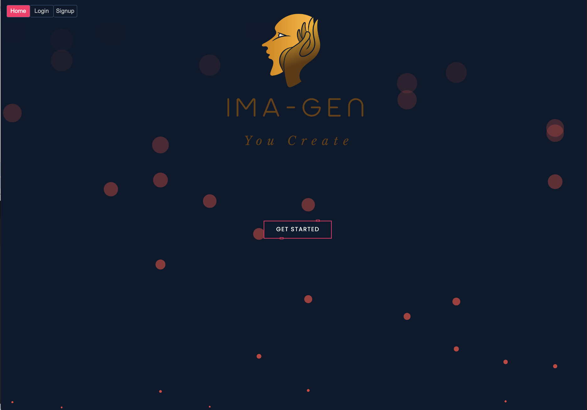
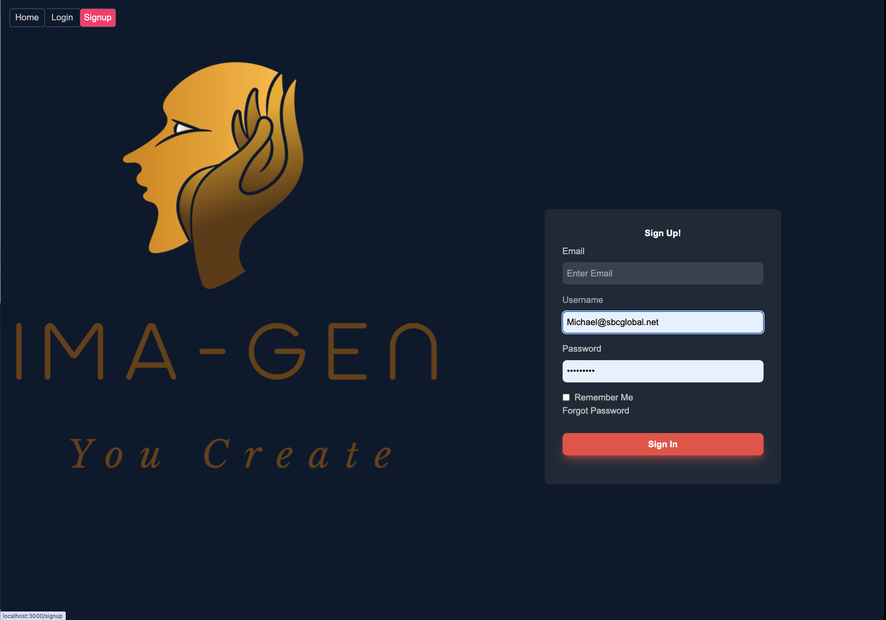
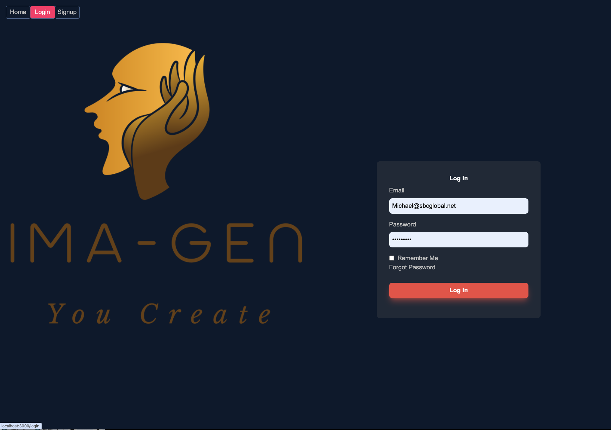
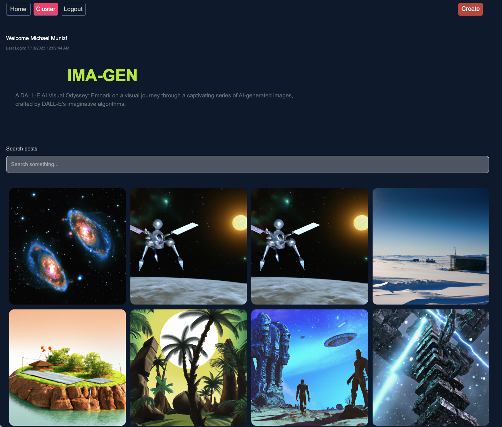
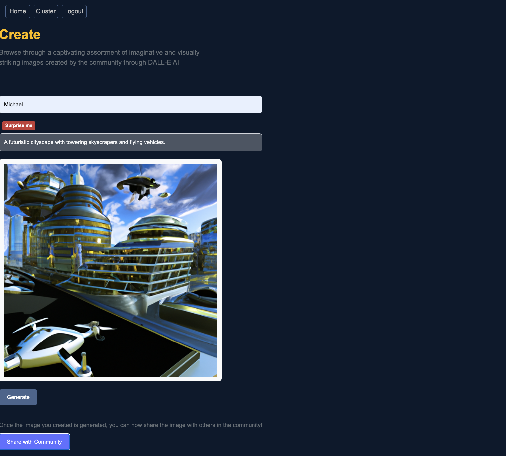
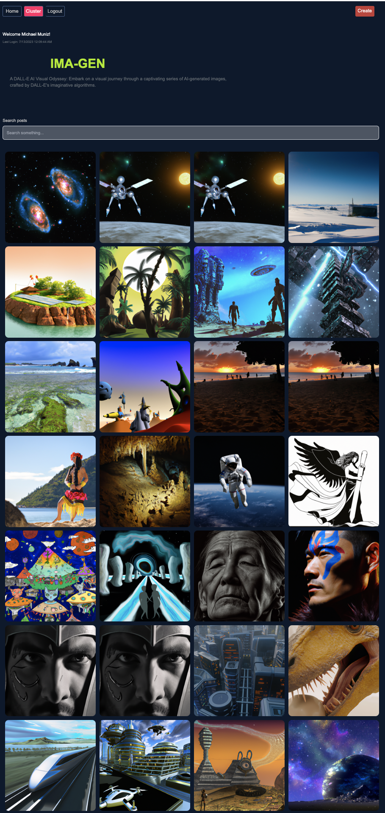

# IMA-GEN


## Description
Welcome to our AI Image Generator! This innovative app harnesses the power of OpenAI's cutting-edge deep learning models to generate stunning and one-of-a-kind images. As a logged-in user, you can explore a cluster page where you'll find a collection of AI-generated images created by both you and other users.

On the cluster page, you have the ability to search through the diverse range of user-created images. If you come across an image you love, you can easily download it and add it to your personal collection. Additionally, you have the option to visit the create page, where you can unleash your creativity and generate your own unique images using the AI models.

Feeling spontaneous? Simply click the "Surprise Me" button to discover a selection of pre-defined prompts that will inspire the AI to generate captivating images for you. Each prompt will result in a different and exciting creation, ensuring endless possibilities for artistic expression.

Our app incorporates essential features such as user authentication to protect your account and ensure a secure experience. We've also implemented environmental variable protection and deployed the app on Heroku for seamless and reliable performance.

Get ready to embark on an imaginative journey with our AI Image Generator and unleash your creativity like never before. Start exploring, creating, and discovering the limitless potential of AI-generated images today!


## Table of Contents
- [Description](#description)
- [Installation](#installation)
- [Usage](#usage)
- [License](#license)
- [Contributing](#contributing)
- [Deployment Link](#deployment-link)


## Installation

1. Clone the repository:

```
git clone https://github.com/
```

2. Install the dependencies:

```
npm run install
```

3. Create a `.env` file in the server directory with the following content:

```
MONGODB_URI - Mongodb compass connection string
SECRET - hash secret
TOKEN_EXP - timeout expiration for JWT token 
OPENAI_API_KEY - OpenAI API key
OPENAI_ORGANIZATION - OpenAI Organization number
CLOUDINARY_CLOUD_NAME - Cloudinary assigned cloud name
CLOUDINARY_API - Cloudinary API key
CLOUDINARY_SECRET - Cloudinary secret key
```

4. Start the application:

```
npm run deploy
```


## Usage

Once the installation is complete, you're ready to start using the AI Image Generator!

1. Visit the live application by navigating to [https://ima-gen-1220c390e173.herokuapp.com/](https://ima-gen-1220c390e173.herokuapp.com/) in your web browser.

2. To start exploring the AI-generated images, you'll need to log in. If you don't have an account, you can easily create one by clicking on the "Sign Up" button and filling in the required fields.

3. Once logged in, you will be redirected to the cluster page. Here, you can view a wide array of AI-generated images. You can download your favorites and add them to your personal collection.

4. Ready to create your own image? Navigate to the "Create" page, enter a prompt in the provided field, and click "Generate". Be patient as the AI generates your unique image. This may take a few moments.

5. If you're in the mood for a surprise, click the "Surprise Me" button. The app will provide a random prompt and generate an image based on it.

6. Enjoy exploring, creating, and discovering the limitless potential of AI-generated art!


## Screenshots








## Deployment Link

The Task Manager Application is deployed on Heroku. Please visit the following link to access the live application: [https://ima-gen-1220c390e173.herokuapp.com/](https://ima-gen-1220c390e173.herokuapp.com/)


## License

This project is licensed under the [MIT License](https://opensource.org/licenses/MIT).


## Contributing


## Credits

Collaborators:  

- Adam Garza https://github.com/AdamGarza33
- Michael Muñiz  https://github.com/m-s-muniz
- Stephen Castillo  https://github.com/stephen-castillo
